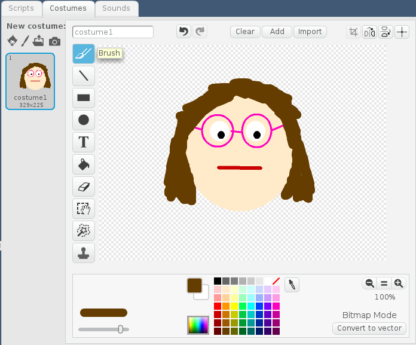

## Create a sweet-munching sprite

The sweet shop reaction game needs a munching face to entertain the player. You will draw a face and animate it to open and close its mouth.

+ Open Scratch on your Raspberry Pi

[[[rpi-scratch-opening]]]

+ Enable the Scratch GPIO extension. This will allow you to use Scratch to talk to the GPIO pins on your Raspberry Pi.

[[[rpi-scratch-add-pi-gpio]]]

+ Delete the Scratch Cat sprite and click on the **paintbrush** icon to draw a new sprite. Draw a face with a closed mouth using the paint editor.



+ Name this costume **face1** by typing the name into the box at the top of the paint editor.

+ Duplicate the costume so you have two identical face costumes.

[[[generic-scratch-duplicate-costumes]]]

+ In the copy of the costume you just made, erase the mouth and then replace it with an open mouth.


Let's program the sprite so that it looks like it is eating sweets!

+ Click on the **Scripts tab**. Add blocks to tell the sprite to display the next costume when the flag is clicked.

```blocks
when flag clicked
next costume
```

+ Click on the green flag a few times and watch what happens to your sprite. Do you see the face swap between the two costumes?

+ Let's make the faces swap automatically rather than only when we click on the flag. Add a `forever`{:class="blockcontrol"} block around the `next costume`{:class="blocklooks"} block. This will make the costume keep switching all the time.

```blocks
when flag clicked
forever
    next costume
end
```

+ Test your code by clicking on the green flag and look at your sprite. It looks like it's gobbling sweets really quickly! Let's add a `wait 1 secs`{:class="blockcontrol"} block to slow it down a little bit.

```blocks
when flag clicked
forever
    next costume
    wait (1) secs
end
```

+ You can change the time from one second to half a second (0.5) or however long you like to make your sprite gobble more quickly or slowly.

+ If you like, you can also click on the stage and paint a sweet shop backdrop, or add one of the backdrops which come with Scratch.


[[[generic-scratch-backdrop-from-library]]]

+ Dont' forget to save your project so far by clicking on **File** > **Save project**.
