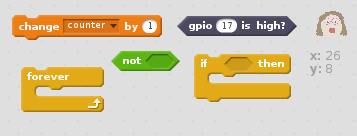

## Reaction game

The object of the game is to see how many times you can squeeze the sweet button in ten seconds.

+ Create a variable called `counter`{:class="blockdata"}. We will use this to count how many times the button is pressed

[[[generic-scratch-add-variable]]]

+ Add some code so that when the flag is clicked the program will reset the counter to 0 to make sure that the player begins on 0 button presses.

```blocks
when flag clicked
set [counter v] to [0]
```
+ Attach some more code which will add 1 to counter whenever GPIO 17 is not high. Use the code you wrote to test your button to help you.

--- hints ---
--- hint ---
Constantly (`forever`{:class="blockcontrol"} ) check `if`{:class="blockcontrol"} GPIO 17 is `not`{:class="blockoperators"} high.

If it is not high, `change counter by 1`{:class="blockdata"}.
--- /hint ---
--- hint ---
Here are the blocks you will need:


--- /hint ---
--- hint ---
Here is the code you will need:

```blocks
when flag clicked
set [counter v] to [0]
forever
    if <not <gpio (17) is high>> then
        change [counter v] by (1)
    end
end
```
--- /hint ---

--- /hints ---


You will need to create two variables for this game: one to count the button presses, and one to count time.

- Repeat the first step to create another variable named **timer**.


- Inside the `if` block add the variable block `change counter by 1` and `play drum 48 for 0.2 beats`. You can select any drum noise that you like from the drop down menu.

	

To set a time limit that counts upwards for the game, you need to add two further scripts:

- Add `when green flag clicked` block to the scripts and connect the sensing block `reset timer` to it.

- Underneath, connect a `forever` looping control block.

- Inside the loop add the variable block `set control to 0` and using the drop-down menu on the block, change **control** to **timer** so that the block reads `set timer to 0`.

- Replace the value `0` in the `set timer to 0` block with the operator block `round`.

- Then add the sensing block `timer` inside the space on the `round' block. The completed block should look like:

	

- Add another `when green flag clicked` control block to the scripts area and connect a `wait until` block to it.

- Add the operators block `=` to the space in the `wait until` block. In the left hand space, add the variable block `timer`. On the right hand side, type a value to represent time. If you want your game to last for ten seconds, type `10`.

- Connect a `stop all` control block to the end of this script.

- Finally, save your game by clicking on the save icon at the top of the screen.

	
